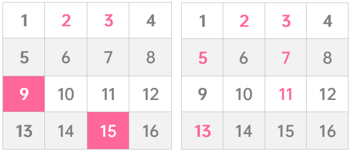

## 参考资料

1. [leetcode 初级算法](https://leetcode-cn.com/leetbook/detail/top-interview-questions-easy/)
2. [计数质数](https://leetcode-cn.com/problems/count-primes/description/)

## 计数质数
统计所有小于非负整数 `n` 的质数的数量。
### 示例 1：
```bash
输入：n = 10
输出：4
解释：小于 10 的质数一共有 4 个, 它们是 2, 3, 5, 7 。
```
### 示例 2：
```bash
输入：n = 0
输出：0
```
### 示例 3：
```bash
输入：n = 1
输出：0
```
### 提示：
- 0 <= n <= $5 * 10^6$

## 前言
统计 $[2,n]$ 中质数的数量是一个很常见的题目，也有很多巧妙高效的做法，接下来的部分只会讲述一些常见的做法，更多的拓展内容读者可以自行搜索补充，也欢迎在评论区与大家分享交流。
## 方法一：枚举

很直观的思路是我们枚举每个数判断其是不是质数。

考虑质数的定义：在大于 1 的自然数中，除了 1 和它本身以外不再有其他因数的自然数。因此对于每个数 x，我们可以从小到大枚举 $[2,x-1]$ 中的每个数 y，判断 y 是否为 x 的因数。但这样判断一个数是否为质数的时间复杂度最差情况下会到 O(n)，无法通过所有测试数据。

考虑到如果 y 是 x 的因数，那么 $\frac{x}{y}$也必然是 x 的因数，因此我们只要校验 y 或者 $\frac{x}{y}$ 即可。而如果我们每次选择校验两者中的较小数，则不难发现较小数一定落在 $[2,\sqrt{x}]$的区间中，因此我们只需要枚举 $[2,\sqrt{x}]$ 中的所有数即可，这样单次检查的时间复杂度从 O(n) 降低至了 $O(\sqrt{n})$。

### 代码
```js
/**
 * @param {number} n
 * @return {number}
 */
const isPrime = (x)=>{
    for(let i =2;i*i <=x;i++){
        if(x%i === 0) return false
    }
    return true
}
var countPrimes = function(n) {
    let ans = 0
    for(let i=2;i<n;i++){
        ans += isPrime(i)
    }
    return ans

};
```
### 复杂度分析

- 时间复杂度：$O(n\sqrt{n})$。单个数检查的时间复杂度为 $O(\sqrt{n})$，一共要检查 O(n) 个数，因此总时间复杂度为 $O(n\sqrt{n})$。
- 空间复杂度：O(1)。

## 方法二：埃氏筛
枚举没有考虑到数与数的关联性，因此难以再继续优化时间复杂度。接下来我们介绍一个常见的算法，该算法由希腊数学家厄拉多塞（$\rm EratosthenesEratosthenes$）提出，称为厄拉多塞筛法，简称埃氏筛。

我们考虑这样一个事实：如果 x 是质数，那么大于 x 的 x 的倍数 2x,3x,$\ldots$ 一定不是质数，因此我们可以从这里入手。

我们设 $\textit{isPrime}[i]$ 表示数 i 是不是质数，如果是质数则为 1，否则为 0。从小到大遍历每个数，如果这个数为质数，则将其所有的倍数都标记为合数（除了该质数本身），即 0，这样在运行结束的时候我们即能知道质数的个数。

这种方法的正确性是比较显然的：这种方法显然不会将质数标记成合数；另一方面，当从小到大遍历到数 x 时，倘若它是合数，则它一定是某个小于 x 的质数 y 的整数倍，故根据此方法的步骤，我们在遍历到 y 时，就一定会在此时将 x 标记为 $\textit{isPrime}[x]=0$。因此，这种方法也不会将合数标记为质数。

当然这里还可以继续优化，对于一个质数 x，如果按上文说的我们从 2x 开始标记其实是冗余的，应该直接**从 $x\cdot x$ 开始标记**，因为 2x,3x,$\ldots$ 这些数一定在 x 之前就被其他数的倍数标记过了，例如 2 的所有倍数，3 的所有倍数等。

### 代码
```js
/**
 * @param {number} n
 * @return {number}
 */
var countPrimes = function(n) {
    const isPrime = new Array(n).fill(1)
    let ans = 0
    for(let i=2;i<n;i++){
        if(isPrime[i]){
            ans+=1;
            for(let j=i*i;j<n;j+=i){
                isPrime[j] =0
            }
        }
    }
    return ans
};
```
### 复杂度分析

- 时间复杂度：$O(n\log \log n)$。具体证明这里不再展开，读者可以自行思考或者上网搜索，本质上是要求解 $\sum_{p}\frac{n}{p}$的和，其中 p 为质数。当然我们可以了解这个算法一个比较松的上界 $O(n\log n)$ 怎么计算，这个等价于考虑 $\sum_{i=1}^{n}\frac{n}{i}$的和，而 $O(\sum_{i=1}^{n}\frac{n}{i}) = O(n\sum_{i=1}^{n}\frac{1}{i})$，而 1 到 n 中所有数的倒数和趋近于 $\log n$，因此 $O(n\sum_{i=1}^{n}\frac{1}{i})=O(n\log n)$。
- 空间复杂度：O(n)。我们需要 O(n) 的空间记录每个数是否为质数。

## 方法三：线性筛
此方法不属于面试范围范畴，本节只做简单讲解。

埃氏筛其实还是存在冗余的标记操作，比如对于 45 这个数，它会同时被 3,5 两个数标记为合数，因此我们优化的目标是让每个合数只被标记一次，这样时间复杂度即能保证为 O(n)，这就是我们接下来要介绍的线性筛。

相较于埃氏筛，我们多维护一个 $\textit{primes}$ 数组表示当前得到的质数集合。我们从小到大遍历，如果当前的数 x 是质数，就将其加入 $\textit{primes}$ 数组。

另一点与埃氏筛不同的是，「标记过程」不再仅当 x 为质数时才进行，而是对每个整数 x 都进行。对于整数 x，我们不再标记其所有的倍数 $x\cdot x$, $x\cdot (x+1)$, $\ldots$，而是只标记质数集合中的数与 x 相乘的数，即 $x\cdot\textit{primes}_0$, $x\cdot\textit{primes}_1$, $\ldots$，且在发现 $x \bmod \textit{primes}_i=0$ 的时候结束当前标记。


核心点在于：如果 x 可以被 $\textit{primes}_i$整除，那么对于合数 $y=x\cdot \textit{primes}_{i+1}$而言，它一定在后面遍历到 $\frac{x}{\textit{primes}_i}\cdot\textit{primes}_{i+1}$ 
这个数的时候会被标记，其他同理，这保证了每个合数只会被其「最小的质因数」筛去，即每个合数被标记一次。

线性筛还有其他拓展用途，有能力的读者可以搜索关键字「[积性函数](https://zh.wikipedia.org/wiki/%E7%A9%8D%E6%80%A7%E5%87%BD%E6%95%B8)」继续探究如何利用线性筛来求解积性函数相关的题目。

### 代码
```js
/**
 * @param {number} n
 * @return {number}
 */
var countPrimes = function(n) {
    const isPrime = new Array(n).fill(1)
    const primes = [];
    for(let i=2;i<n;i++){
        if(isPrime[i]){
            primes.push(i)
        }
        for(let j=0;j< primes.length && i*primes[j]<n;++j){
            isPrime[i * primes[j]] = 0
            if(i % primes[j] ==0){
                break;
            }
        }
    }
    return primes.length;
};
```
### 复杂度分析

- 时间复杂度：O(n)。
- 空间复杂度：O(n)。


## 奇数筛
### 解题思路
- `质数`一定是`奇数`，`偶数`一定不是`质数`。只用在奇数范围标记合数，未标记是`质数`
- `奇数` 乘以 `偶数` 一定是 `偶数`。只用`奇数` 乘以 `奇数`，确保在奇数范围内标记
- 用上面的两条优化埃氏筛解法，过程如图



### 代码
```js
/**
 * @param {number} n
 * @return {number}
 */
var countPrimes = function(n) {
    const isCom= new Int8Array(n),
    const b = Math.sqrt(n)
    let   r = n > 2 ? 1 : 0
    let   t;
    for(let i = 3; i < n; i += 2) {
        if(!isCom[i]) {
            r++
            if (i <= b){ 
                // 记录合数
                for(let j = i; (t = i * j) < n; j += 2){ 
                    isCom[t] = 1
                }
            }
        }
    }
    return r
};
```
