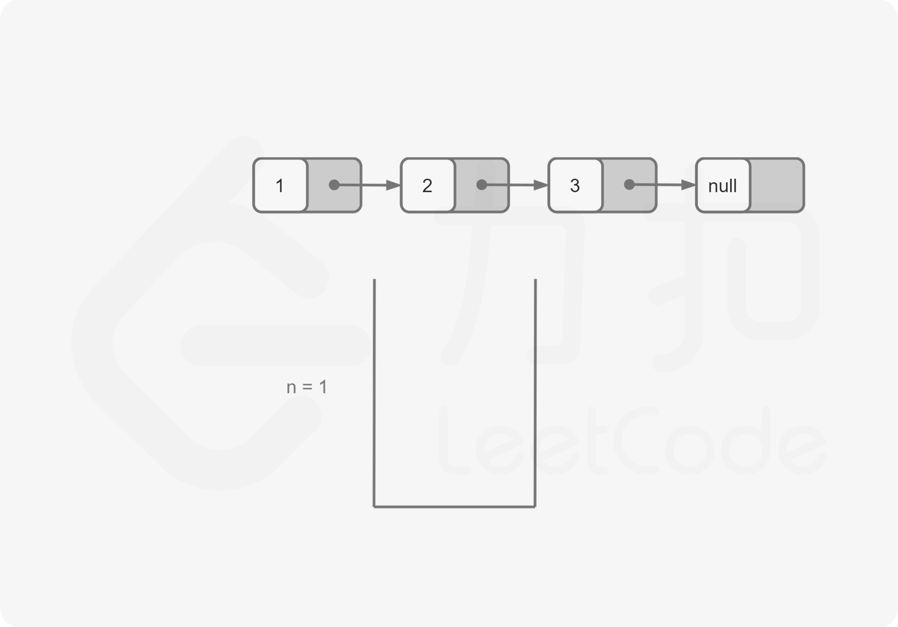

## 参考资料

1. [leetcode 初级算法](https://leetcode-cn.com/leetbook/detail/top-interview-questions-easy/)
2. [删除链表的倒数第N个节点](https://leetcode-cn.com/problems/remove-nth-node-from-end-of-list/description/)

## 删除链表的倒数第N个节点
给定一个链表，删除链表的倒数第 n 个节点，并且返回链表的头结点。

### 示例：
```bash
给定一个链表: 1->2->3->4->5, 和 n = 2.

当删除了倒数第二个节点后，链表变为 1->2->3->5.
```
### 说明：

给定的 n 保证是有效的。

### 进阶：

你能尝试使用一趟扫描实现吗？

## 方法一：计算链表长度

### 思路与算法
一种容易想到的方法是，我们首先从头节点开始对链表进行一次遍历，得到链表的长度 LL。随后我们再从头节点开始对链表进行一次遍历，当遍历到第 L-n+1L−n+1 个节点时，它就是我们需要删除的节点。

>为了与题目中的 n 保持一致，节点的编号从 1 开始，头节点为编号 1 的节点。

为了方便删除操作，我们可以从哑节点开始遍历 L-n+1 个节点。当遍历到第 L-n+1个节点时，它的下一个节点就是我们需要删除的节点，这样我们只需要修改一次指针，就能完成删除操作。


### 代码
```js
/**
 * @param {ListNode} head
 * @param {number} n
 * @return {ListNode}
 */
var removeNthFromEnd = function(head, n) {
    let length = 0;
    let headNow = head;
    while(headNow != null) {
        length++;
        headNow = headNow.next;
    }
    // 考虑删除的是头部指针
    if(length === n){
        head = head.next
        return head
    }
    headNow = head;
    for(let i=1;i<length-n;i++){
        headNow = headNow.next
    }
    headNow.next = headNow.next.next
    return head
};
```
### 复杂度分析

- 时间复杂度：$O(L)$，其中 L 是链表的长度。
- 空间复杂度：$O(1)$。

## 方法二：栈
### 思路与算法
我们也可以在遍历链表的同时将所有节点依次入栈。根据栈「先进后出」的原则，我们弹出栈的第 n 个节点就是需要删除的节点，并且目前栈顶的节点就是待删除节点的前驱节点。这样一来，删除操作就变得十分方便了。



### 代码
```js
/**
 * @param {ListNode} head
 * @param {number} n
 * @return {ListNode}
 */
var removeNthFromEnd = function(head, n) {
    let headNow = head;
    let stack = []
    // 进栈
    while(headNow != null) {
        stack.push(headNow)
        headNow = headNow.next;
    }
    // 考虑删除的是头部指针
    if(stack.length === n){
        return head.next
    }
    // 出栈
    // 删除的节点
    stack[stack.length - n - 1].next = stack[stack.length - n ].next
    return head;
};
```
### 复杂度分析

- 时间复杂度：O(L)，其中 L 是链表的长度。
- 空间复杂度：O(L)，其中 L 是链表的长度。主要为栈的开销。
## 方法三：一次遍历

### 思路与算法

我们也可以在不预处理出链表的长度，以及使用常数空间的前提下解决本题。

由于我们需要找到倒数第 n 个节点，因此我们可以使用两个指针 $\textit{first}$ 和 $\textit{second}$同时对链表进行遍历，并且 $\textit{first}$ 比 $\textit{second}$ 超前 n 个节点。当 $\textit{first}$ 遍历到链表的末尾时，$\textit{second}$ 就恰好处于倒数第 n 个节点。

具体地，初始时 $\textit{first}$ 和 $\textit{second}$ 均指向头节点。我们首先使用 $\textit{first}$ 对链表进行遍历，遍历的次数为 n。此时，$\textit{first}$ 和 $\textit{second}$ 之间间隔了 n-1 个节点，即 $\textit{first}$ 比 $\textit{second}$ 超前了 n 个节点。

在这之后，我们同时使用 $\textit{first}$ 和 $\textit{second}$ 对链表进行遍历。当 $\textit{first}$ 遍历到链表的末尾（即 $\textit{first}$ 为空指针）时，$\textit{second}$ 恰好指向倒数第 n 个节点。

根据方法一和方法二，如果我们能够得到的是倒数第 n 个节点的前驱节点而不是倒数第 n 个节点的话，删除操作会更加方便。因此我们可以考虑在初始时将 $\textit{second}$ 指向哑节点，其余的操作步骤不变。这样一来，当 $\textit{first}$ 遍历到链表的末尾时，$\textit{second}$ 的下一个节点就是我们需要删除的节点。


### 代码
```js
/**
 * @param {ListNode} head
 * @param {number} n
 * @return {ListNode}
 */
var removeNthFromEnd = function(head, n) {
    let fastPoint = head;
    let slowPoint = head;
    for(let i=0;i<n;i++)
        fastPoint = fastPoint.next;
    // 边界 条件的 判断 删除 为 头指针
    if(fastPoint === null) return head.next
    while(fastPoint.next != null){
        fastPoint = fastPoint.next
        slowPoint = slowPoint.next        
    }
    slowPoint.next = slowPoint.next.next
    return head
};
```

### 复杂度分析

- 时间复杂度：O(L)，其中 L 是链表的长度。
- 空间复杂度：O(1)。