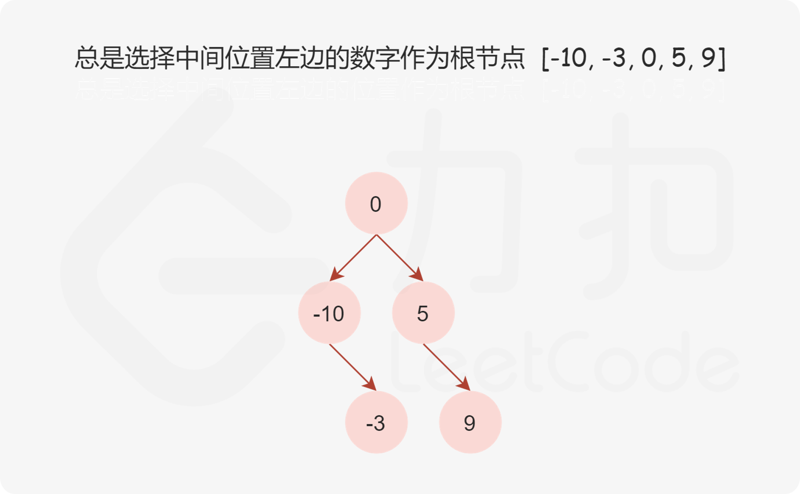
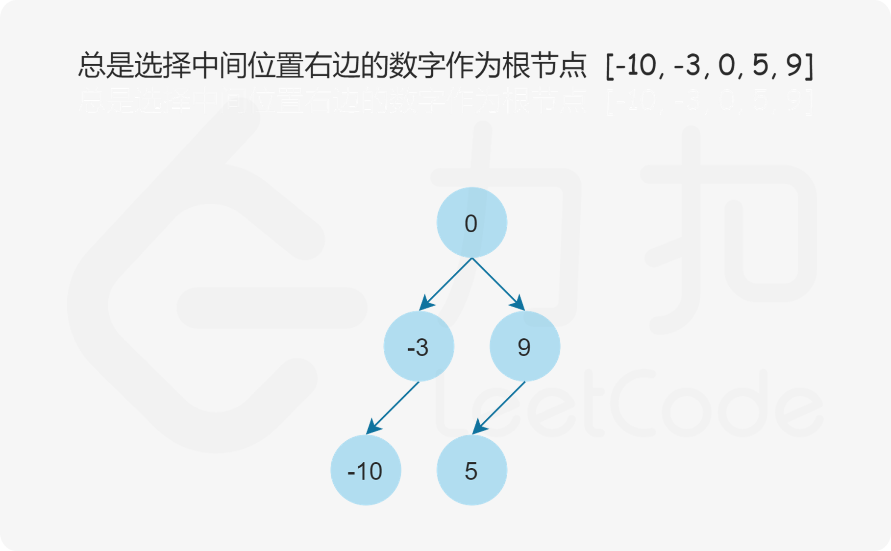

## 参考资料

1. [leetcode 初级算法](https://leetcode-cn.com/leetbook/detail/top-interview-questions-easy/)
2. [将有序数组转换为二叉搜索树](https://leetcode-cn.com/problems/convert-sorted-array-to-binary-search-tree/description/)

## 将有序数组转换为二叉搜索树
将一个按照升序排列的有序数组，转换为一棵高度平衡二叉搜索树。

本题中，一个高度平衡二叉树是指一个二叉树每个节点 的左右两个子树的高度差的绝对值不超过 1。

### 示例:
```bash
给定有序数组: [-10,-3,0,5,9],

一个可能的答案是：[0,-3,9,-10,null,5]，它可以表示下面这个高度平衡二叉搜索树：

      0
     / \
   -3   9
   /   /
 -10  5
```
## 前言
二叉搜索树的中序遍历是升序序列，题目给定的数组是按照升序排序的有序数组，因此可以确保数组是二叉搜索树的中序遍历序列。

给定二叉搜索树的中序遍历，是否可以唯一地确定二叉搜索树？答案是否定的。如果没有要求二叉搜索树的高度平衡，则任何一个数字都可以作为二叉搜索树的根节点，因此可能的二叉搜索树有多个。


如果增加一个限制条件，即要求二叉搜索树的高度平衡，是否可以唯一地确定二叉搜索树？答案仍然是否定的。


直观地看，我们可以选择中间数字作为二叉搜索树的根节点，这样分给左右子树的数字个数相同或只相差 11，可以使得树保持平衡。如果数组长度是奇数，则根节点的选择是唯一的，如果数组长度是偶数，则可以选择中间位置左边的数字作为根节点或者选择中间位置右边的数字作为根节点，选择不同的数字作为根节点则创建的平衡二叉搜索树也是不同的。


确定平衡二叉搜索树的根节点之后，其余的数字分别位于平衡二叉搜索树的左子树和右子树中，左子树和右子树分别也是平衡二叉搜索树，因此可以通过递归的方式创建平衡二叉搜索树。

当然，这只是我们直观的想法，为什么这么建树一定能保证是「平衡」的呢？这里可以参考「1382. 将二叉搜索树变平衡」，这两道题的构造方法完全相同，这种方法是正确的，[1382 题解](https://leetcode-cn.com/problems/balance-a-binary-search-tree/solution/jiang-er-cha-sou-suo-shu-bian-ping-heng-by-leetcod/)中给出了这个方法的正确性证明：1382 官方题解，感兴趣的同学可以戳进去参考。

递归的基准情形是平衡二叉搜索树不包含任何数字，此时平衡二叉搜索树为空。

在给定中序遍历序列数组的情况下，每一个子树中的数字在数组中一定是连续的，因此可以通过数组下标范围确定子树包含的数字，下标范围记为 $[\textit{left}, \textit{right}$]。对于整个中序遍历序列，下标范围从 $\textit{left}=0$ 到 $\textit{right}=\text{nums.length}-1$。当 $\textit{left}>\textit{right}$ 时，平衡二叉搜索树为空。

以下三种方法中，方法一总是选择中间位置左边的数字作为根节点，方法二总是选择中间位置右边的数字作为根节点，方法三是方法一和方法二的结合，选择任意一个中间位置数字作为根节点。

### 方法一：中序遍历，总是选择中间位置左边的数字作为根节点
选择中间位置左边的数字作为根节点，则根节点的下标为 $\textit{mid}=(\textit{left}+\textit{right})/2$，此处的除法为整数除法。



### 代码
```js
/**
 * @param {number[]} nums
 * @return {TreeNode}
 */
const helper = function(nums, left, right){
    if(left > right){
        return null
    }
    // 总是选择中间位置 左边的数字作为根节点
    let mid = parseInt((left + right) / 2)
    let root = new TreeNode(nums[mid])
    root.left = helper(nums, left, mid -1)
    root.right = helper(nums, mid+1, right)
    return root
}
var sortedArrayToBST = function(nums) {
    // 中序遍历
    return helper(nums,0,nums.length -1)
};
```
### 复杂度分析

- 时间复杂度：$O(n)$，其中 n 是数组的长度。每个数字只访问一次。
- 空间复杂度：$O(\log n)$，其中 n 是数组的长度。空间复杂度不考虑返回值，因此空间复杂度主要取决于递归栈的深度，递归栈的深度是 $O(\log n)$。


## 方法二：中序遍历，总是选择中间位置右边的数字作为根节点
选择中间位置右边的数字作为根节点，则根节点的下标为 $\textit{mid}=(\textit{left}+\textit{right}+1)/2$ ，此处的除法为整数除法。



### 代码
```js
/**
 * @param {number[]} nums
 * @return {TreeNode}
 */
const helper = function(nums, left, right){
    if(left > right){
        return null
    }
    // 总是选择中间位置 右边的数字作为根节点
    let mid = parseInt((left + right+1) / 2)
    let root = new TreeNode(nums[mid])
    root.left = helper(nums, left, mid -1)
    root.right = helper(nums, mid+1, right)
    return root
}
var sortedArrayToBST = function(nums) {
    // 中序遍历
    return helper(nums,0,nums.length -1)
};
```

### 复杂度分析

- 时间复杂度：$O(n)$，其中 n 是数组的长度。每个数字只访问一次。
- 空间复杂度：$O(\log n)O(logn)$，其中 nn 是数组的长度。空间复杂度不考虑返回值，因此空间复杂度主要取决于递归栈的深度，递归栈的深度是 $O(\log n)$。


## 方法三：中序遍历，选择任意一个中间位置数字作为根节点
选择任意一个中间位置数字作为根节点，则根节点的下标为 $\textit{mid}=(\textit{left}+\textit{right})/2$ 和 $\textit{mid}=(\textit{left}+\textit{right}+1)/2$ 两者中随机选择一个，此处的除法为整数除法。


### 代码
```js
/**
 * @param {number[]} nums
 * @return {TreeNode}
 */
const helper = function(nums, left, right){
    if(left > right){
        return null
    }
    // 总是选择中间 随意位置 的数字作为根节点
    let mid = parseInt((left + right + Math.round(Math.random())) / 2)
    let root = new TreeNode(nums[mid])
    root.left = helper(nums, left, mid -1)
    root.right = helper(nums, mid+1, right)
    return root
}
var sortedArrayToBST = function(nums) {
    // 中序遍历
    return helper(nums,0,nums.length -1)
};
```
### 复杂度分析
- 时间复杂度：$O(n)$，其中 n 是数组的长度。每个数字只访问一次。
- 空间复杂度：$O(\log n)$，其中 n 是数组的长度。空间复杂度不考虑返回值，因此空间复杂度主要取决于递归栈的深度，递归栈的深度是 $O(\log n)$。